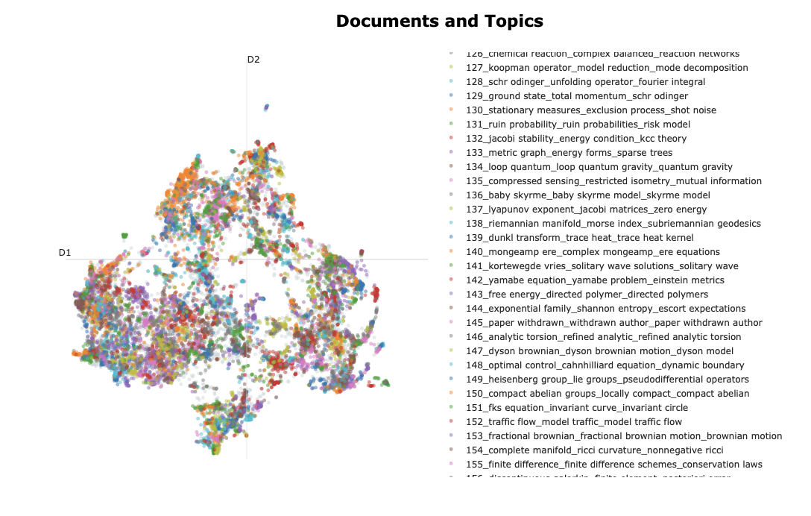
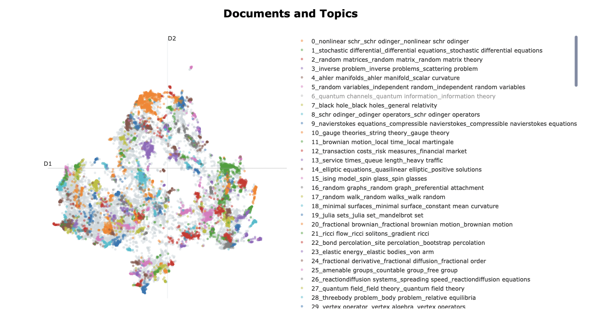
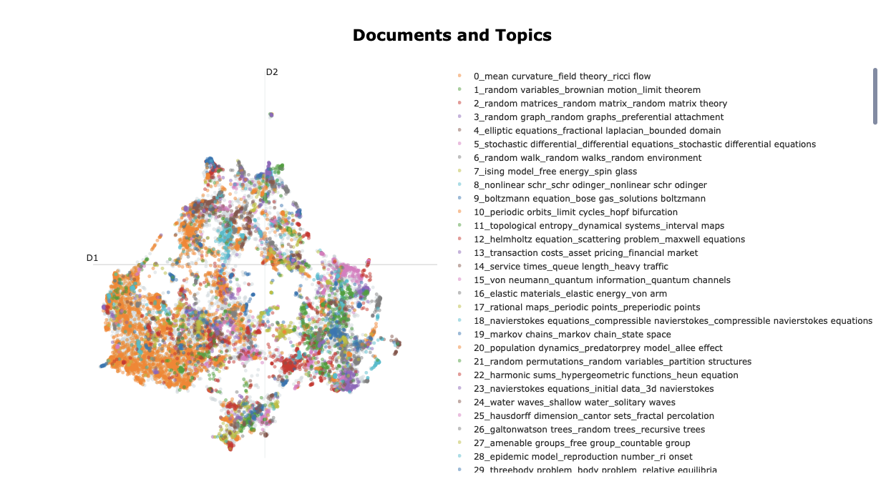
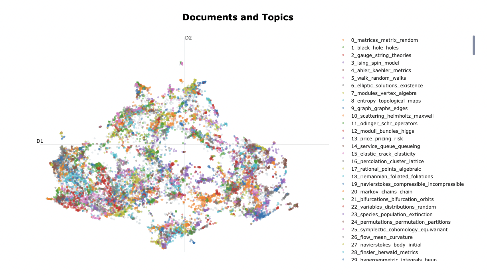
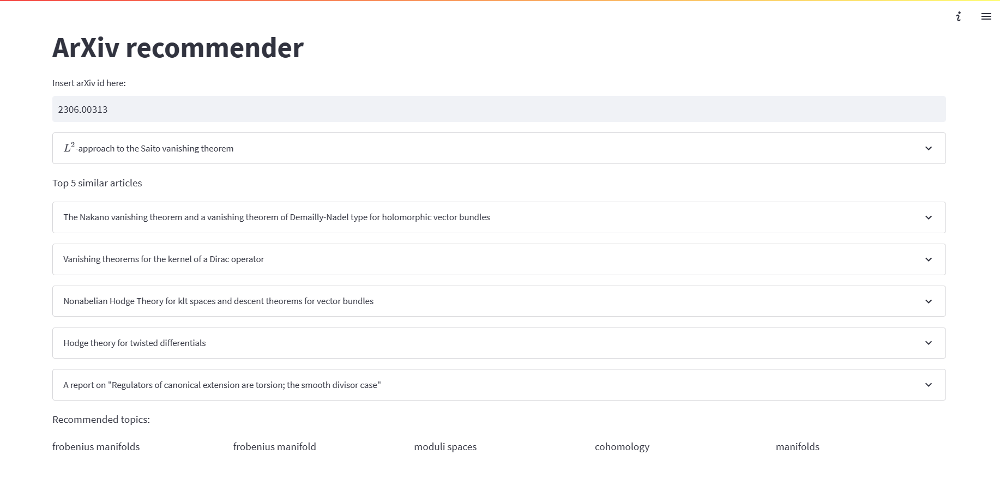

# Arxiv Recommender
----------

This project is part of Erdos Institute 2023 Data Science Bootcamp.

## Table of Contents
--------------------------------
- [Data Description](#data-description)
    - [filter_20k.parquet](#filter_20k.parquet)
- [Using Word2Vec and Doc2Vec to Recommend Articles](#Using-Word2Vec-and-Doc2Vec-to-Recommend-Articles)
    - [Analysis of Models](#Analysis-of-Models)
- [One-Step Topic Analysis using BERTopic](#One-Step-Topic-Analysis-Using-BERTopic)
    - [UMAP hyperparameter tuning](#UMAP-hyperparameter-tuning)
    - [Reducing the number of topics and outliers](#Reducing-the-number-of-topics-and-outliers)
- [Dashboard](#dashboard)
 


### Data Description
------------------------------------

#### filter_20k.parquet
This dataframe contains the metadata from a uniform sample of 20,000 math papers among those with subject tags in the following list:

- `math.DS` : Dynamical systems
- `math.AP` : PDEs
- `math.MP` : Mathematical Physics
- `math.DG` : Differential Geometry
- `math.PR` : Probability

It contains many columns but we will primarily be interested in:

- `title`: the title of the arxiv paper. String.
- `abstract`: the abstract summary of the arxiv paper. String.

## Using Word2Vec and Doc2Vec to Recommend Articles
---------------------------------

Word2Vec is an algorithm which computes a feature vector for every word in the corpus, wheras Doc2Vec computes a feature vector for every document in the corpus.

We used a pre-trained Word2Vec model and also trained two of our own Doc2Vec models: one using distributed bag of words and the other using distributed memory. The difference between the distributed bag of words and the distributed memory model is that the distributed memory model approximates the word using the context of surrounding words and the distributed bag of words model uses the target word to approximate the context of the word.

We then tested our models on articles familiar to the contributers of this Github repository. The inputs to our recommendation algorithms are one or more arXiv ids of papers pertaining to the user's interests. The user then requests the number of recommendations they would like to receive. 

We use two approaches to recommend articles:

- (1) [word2vec-doc2vec-ver1.ipynb](https://github.com/Anirban-7/Arxiv_Recommender/blob/main/word2vec-doc2vec-ver1.ipynb)
     - For each tokenized abstract we compute the cosine similarities with all of the elements in the dataset add them to a new dataset.
     - Sort the rows in the dataset created in part (1) from highest to lowest by cosine similarity. 
     - Remove all duplicate articles from the dataset keeping only the ones with the largest cosine similarity. Return the first $n$ articles in the dataset.
- (2) [word2vec-doc2vec-ver2.ipynb](https://github.com/Anirban-7/Arxiv_Recommender/blob/main/word2vec-doc2vec-ver2.ipynb) 
      - Merge the tokens of the all abstracts the user inputs into one merged abstract.
      - Return the $n$ articles with the highest cosine similarity with the merged abstract in the dataset.
    
### Analysis of Models
---------------------------------
Our testing of the three models involved inputting three arXiv ids generating the 10 most similar papers from our dataset of 20,000 papers. The input size of 3 was chosen primarily due to limiting computation time. 

The contributers' individual rankings of the three models can be found at the bottom of the aforementioned notebooks. A general trend is that Doc2Vec with distributed memory outperforms Doc2Vec with bag of words. However, opinions on the performance of Word2Vec relative to the Doc2Vec models vary.


## One-Step Topic Analysis using BERTopic
---------------------------------
In this section, we employ `BERTopic` for topic modeling of arXiv math papers. BERTopic executes topic analysis in three distinct steps:

- Step 1) It uses a vector embedding model to convert the titles and abstracts of arXiv papers into vectors. In the `One-Step Topic Analysis using BERTopic` notebook, we leverage the Sentence Transformer `(sBERT) all-MiniLM-L6-v2`.
- Step 2) Dimensionality of the vectors is reduced employing `UMAP` (Uniform Manifold Approximation and Projection), which introduces a stochastic aspect to the process. To reproduce our results, we set random_state = 623.
- Step 3) Topic clusters are identified using `HDBScan`, a hierarchical, density-based clustering algorithm.

To optimize `BERTopic`, we tune the hyperparameters of `UMAP` and `HDBScan`. However, given the multitude of hyperparameters, we first focus on tuning UMAP's `n_neighbors` and `n_components`. Following this, we indirectly adjust HDBscan's hyperparameters through the built-in `reduce_topics` and `reduce_outliers` methods.

In order to evaluate the effectiveness of our models, we task them with classifying unseen arXiv papers and undertake the following:

- Compute the ratio of papers classified as outliers by the model. Ideally, this value should be low.
- Validate the model's classifications, provided the papers have not been categorized as outliers. This will be done by math PhDs who have done research in those fields. 


### UMAP hyperparameter tuning
----------------------------------------
We will be primarily interested in the `UMAP` hyperparameters `n_neighbors` and `n_components`.
- `n_neighbors` : This parameter controls how UMAP balances local versus global structure in the data. It does this by constraining the size of the local neighborhood UMAP will look at when attempting to learn the manifold structure of the data. Low values of `n_neighbors` will force UMAP to concentrate on very local structure (potentially to the detriment of the big picture), while large values will push UMAP to look at larger neighborhoods of each point when estimating the manifold structure of the data, losing fine detail structure for the sake of getting a broader view of the data. 
- `n_components` : This is the dimensionality of the lower-dimensional space we will be embedding the data into.

In our investigation, we experimented with `n_neighbors` values of 5, 15, and 50, and n_components values of 2, 5, and 10. The images below visualize the document clusters in the training set, labeled by distinct colors to represent different topic clusters.

n_neighbors = 5, n_components = 2


n_neighbors = 50, n_components = 10


We observed a trend: increasing `n_neighbors` and `n_components` values enlarges the uncolored region, representing outliers - an outcome we aim to avoid. The provided images are illustrative of the extreme cases.

Interestingly, `BERTopic` models with lower `n_neighbors` and `n_components` tend to classify a smaller ratio of papers as outliers. However, we need to be cautious to not set these values too low. As the dimensionality (`n_components`) of the reduced space decreases, the model tends to conflate papers with others that may not be thematically similar. This overconfidence occasionally results in the model assigning papers to less relevant topics.

For instance, the model configured with `n_neighbors = 5` categorized the paper [arXiv:2305.16270](https://arxiv.org/abs/2305.16270) as a paper on random graphs. While the paper does indeed discuss a combinatorial object of a random nature, it primarily pertains to homotopy theory. Given the relatively limited number of algebraic topology papers in our corpus, it might have been more accurate for the model to classify it as an outlier, rather than forcing an ill-fitting assignment to the random graph topic.

After careful consideration, we determined `n_neighbors = 5` and `n_components = 5` as the optimal hyperparameters for our task.


### Reducing the number of topics and outliers
------------------------------
We now turn to the built-in BERTopic methods, `reduce_topics` and `reduce_outliers`. Invoking these methods indirectly fine-tunes the hyperparameters of HDBScan, namely `min_cluster_size` and `min_samples`. 
- `min_cluster_size` : the smallest size grouping that you wish to consider a cluster.
- `min_samples` : it provides a measure of how conservative you want you clustering to be. The larger the value of `min_samples` you provide, the more conservative the clustering – more points will be declared noise, and clusters will be restricted to progressively more dense areas. 

After applying `reduce_topics`, we observe:



a sizable orange cluster has emerged in the bottom left corner. This cluster results from merging several loosely correlated topics, which is not the optimal outcome for our analysis.

This does not happen when we only apply reduce_outliers to the BERTopic model as depicted below.



Thus, we conclude that the BERTopic model with `n_neighbors = 5`, `n_components = 5`, and with `reduce_outliers` applied, best suits our needs.

### Dashboard
-----------------------------------
The app takes a single arxiv id as input and returns five similar papers as recommendations based on a semantic search applied to the title and abstract. 
The topic clusters corresponding to the best model are stored for each paper in our database. We keep only the unique topic clusters for each paper and run a semantic search on the topic labels for the five similar papers. We display only the top 5 related topics.




```python

```
